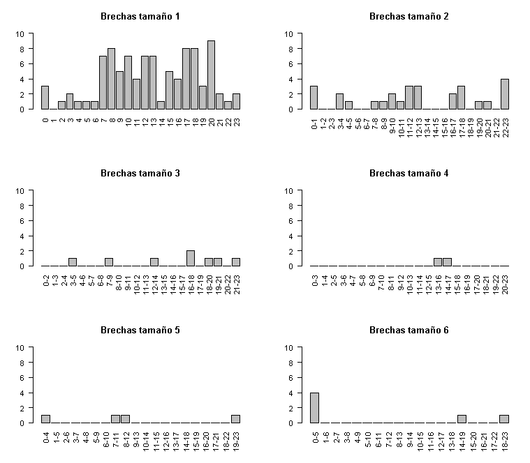

```{r setup, include=FALSE}
knitr::opts_chunk$set(echo = FALSE)

library(tidyverse)
library(lubridate)
library(reshape)
library(plotly)
library(ggcorrplot)


```

class: center, middle
### /ʃæ.'riŋ.ɡæn/

<script type="text/x-mathjax-config">
  MathJax.Hub.Config({ TeX: { equationNumbers: {autoNumber: "all"} } });
</script>


---

#Introducción

<div style="text-align: justify;
margin-top:100px"

<div/>

El presente documento corresponde a una propuesta de imputación para una base de datos de contaminante atmosférico $PM_{2.5}$ a partir de la distribución normal multivariada. La información usada pertenece al sistema de vigilancia de la calidad del aire (SVCA) de Cali y consta de mediciones horarias tomadas diariamente durante el año 2018 en la estación de Univalle.


---

#Planteamiento del problema

<div style="text-align: justify;
margin-top:100px">


- La recolección de información de los contaminantes se ve afectada por diversos motivos que generan espacios en blanco o faltas en las bases de datos que pueden afectar en las propiedades de los indicadores.

- En un estudio previo Otero & Presiga (2019) reportan que las mediciones por hora $i\,\,\, (i=1,...,24)$ del día $j\,\,\, (j=1,...,7)$ se distribuyen normal. además que pueden existir distribuciones normales bivariadas entre cada hora $(i\,\,\, e\,\,\, i')$.

- Ahora bien, en un escenario ideal el proceso generador del $PM_{2 . 5}$ en un día $j$ se distribuye normal multivariado. Así, se tendrán 7 normales 24-variadas.

- El reto cosiste en determinar la existencia de estas 7 distribuciones normales 24-variadas y con sus propiedades proponer un método de imputación para los datos faltantes de $PM_{2 . 5}$.


<div/>


---

#Justificación

<div style="text-align: justify">

## Estadística
Aportar a partir de la imputación estadística a mejorar las estimaciones para indicadores de la calidad del aire conservando la calidad de la información.

Para aportar en el desarrollo de métodologías de imputación a partir de la normal multivariada en bases de datos de contaminación ambiental,  cambiando la perspectiva de datos funcionales.

## Contextual


La evidencia entre la relación de las concentraciones de $PM_{2_{\cdot }5}$ y $PM_{10}$ en el aire con enfermedades de tipo respiratorio y cardiovascular aumentando la morbilidad de los seres humanos, en especial en las grandes ciudades (OMS, 2018b).

Es importante que la información de la calidad del aire sea precisa para generar indicadores confiables que permitan impulsar acciones.

<div/>


---
#Objetivos

<div style="text-align: justify">


## Objetivo general

Proponer un método de imputación para los datos faltantes de $PM_{2_{\cdot }5}$, basado en una distribución normal multivariada.  

##Objetivos especificos

- Verificar si los datos de $PM_{2_{\cdot }5}$ para cada día se distribuye como una normal multivariada.

- Estimar las matrices de varianzas y covarianzas de los datos de $PM_{2_{\cdot }5}$ para para cada día j $(j=1,...,7)$ con el fin proponer la distribución de cada día como una Normal 24-variada.

- Evaluar vía simulación la precisión del(los) método(s) de imputación propuesto(s).

- Escoger entre los evaluados, el método que mejor se ajuste para imputar los datos faltantes de  $PM_{2_{\cdot }5}$5 a partir de cada normal multivariada.

<div/>


---
#Antecedentes
<div style="text-align: justify">
<br>
<div class="wrap-collabsible">
<input id="collapsible09" class="toggle" type="checkbox"><label for="collapsible09" class="lbl-toggle">
Junger & De Leon (2015)
<br>
</label>
<div class="collapsible-content">
<div class="content-inner">
<p class="text">
Aplica un algoritmo de imputación múltiple para series de tiempo multivariadas en 10 estaciones de monitoreo de PM10 en Sao Pablo. Mediante el algoritmo EM estiman $\mu\,\,,\Sigma$ y ajustan modelos ARIMA a cada serie de tiempo univariada para actualizar las estimaciones. La imputación usando el algorimo EM regular arrojo estimaciones precisas bajo diferentes porcentajes de de faltas (5%, 10% ) incluso con el incumplimiento del supuesto missing at random (MAR).
</div>
</div>
</div>


<div class="wrap-collabsible">
<input id="collapsible10" class="toggle" type="checkbox"><label for="collapsible10" class="lbl-toggle">
Caicedo & Jimenez (2016)
<br>
</label>
<div class="collapsible-content">
<div class="content-inner">
<p class="text">
 Proponen un método de imputación para los datos faltantes de las concentraciones horarias promedio de $PM_{2_{\cdot }5}$ en la estación Univalle de Santiago de Cali, basado en que el proceso generador de cada hora - día de la semana es normal con parámetros estimados a partir del análisis de datos funcionales.
</div>
</div>
</div>

<div class="wrap-collabsible">
<input id="collapsible11" class="toggle" type="checkbox"><label for="collapsible11" class="lbl-toggle">
Otero & Presiga (2019)
<br>
</label>
<div class="collapsible-content">
<div class="content-inner">
<p class="text">
Evalúan el método propuesto por Caicedo & Jimenez (2016), además de incluir una nueva propuesta de imputación donde en lugar de generar un sólo valor de la distribución del hora-día de la semana se generan 5 y el valor imputado será el promedio de estos. Encontrando resultados  promisorios, recomendando que se puede seguir con el estudio incluyendo una estructura de correlación entre las horas de cada día de la semana.
</div>
</div>
</div>
</div>


---

#Marco teórico 

<div style="text-align: justify;
margin-top:100px">

<div/>

## $PM_{2.5}$


 Conjunto de partículas suspendidas en el aire que tienen tamaño menor o igual a $2 . 5 \mu m$ (micras).  conformadas por  sustancias  químicas  tales  como  Sulfato,  Nitrato,  Amoniaco,  Carbón  y  Metales pesados. El $PM_{2_{\cdot }5}$ en estado de "acumulación" (entre 0.1 y 0.2 $\mu m$) pueden durar suspendidas varios días en el aire. 

Se afirma que el tamaño del material partículado está inversamente relacionado con el potencial para contraer  problemas de salud cardiovascular (OMS, 2018), debido a que las partículas que ingresan por las vías respiratorias pueden alojarse en los pulmones, o pasar directamente a los vasos sanguíneos

---

#Marco teórico


<div style="margin-bottom:100px;">
</div>
<center>

<style type="text/css">
.tg  {border-collapse:collapse;border-spacing:0;}
.tg td{border-color:black;border-style:solid;border-width:1px;font-family:Arial, sans-serif;font-size:14px;
  overflow:hidden;padding:10px 5px;word-break:normal;}
.tg th{border-color:black;border-style:solid;border-width:1px;font-family:Arial, sans-serif;font-size:14px;
  font-weight:normal;overflow:hidden;padding:10px 5px;word-break:normal;}
.tg .tg-dvpl{border-color:inherit;text-align:right;vertical-align:top}
</style>
<table class="tg">
<thead>
  <tr>
    <th class="tg-dvpl">Lugar</th>
    <th class="tg-dvpl">Tiempo de Exposición</th>
    <th class="tg-dvpl">Nivel Máx.</th>
  </tr>
</thead>
<tbody>
  <tr>
    <td class="tg-dvpl">Minambiente</td>
    <td class="tg-dvpl">Anual</td>
    <td class="tg-dvpl">25 $\mu g/m^3$</td>
  </tr>
  <tr>
    <td class="tg-dvpl"></td>
    <td class="tg-dvpl">Diario</td>
    <td class="tg-dvpl">50 $\mu g/m^3$</td>
  </tr>
  <tr>
    <td class="tg-dvpl">ONU</td>
    <td class="tg-dvpl">Anual</td>
    <td class="tg-dvpl">10 $\mu g/m^3$</td>
  </tr>
  <tr>
    <td class="tg-dvpl"></td>
    <td class="tg-dvpl">Diario</td>
    <td class="tg-dvpl">25 $\mu g/m^3$</td>
  </tr>
</tbody>
</table>
</center>
<div style="text-align: center">
**Tabla 1**: Nivel máximo de exposición permisible del contaminante $PM_{2_{\cdot }5}$
<div/>

<div style="text-align: justify">


Los niveles máximos permisibles internacionales son más estrictos y Colombia se piensa igualar su norma a este nivel para el año 2030
<div/>


---

# Marco teórico

## Datos faltantes

<div style="text-align: justify">

Sea $X = (X_1,...,X_p)$ un vector aleatorio con función de probabilidad $f_{\theta}$,  donde  $\theta$ es el vector de parámetros de interés y a $M = (M_i,...,M_p)$ como el indicador de falta asociado al vector aleatorio X, que toma el valores:
<div/>

$$m_i = \left\{\begin{matrix}
 \,\, 0 \,\,  \,\,\,\, si \,\, x_i\, no \,\, es \,\, observada \\ \\
1 \,\,  \,\,\,\, si \,\,x_i\,\, es \,\,\,\, observada  \,\,\,\,\,\,
\end{matrix}\right.$$

<div style="text-align: justify">
La probabilidad de que $M$ tome el valor de $m=(m_1,...,m_p)$ dado que $X$ toma el valor de $x=x_1,...,x_p$ es:
<div/>

$$g_\phi(m|x) = g_\phi(m|(x_{(0)},x_{(1)}))$$
<div/>


---

# Marco teórico

## Datos faltantes

<div style="text-align: justify">

Rubin (1976) Plantea formalmente el fenómeno de datos faltantes, de los cuales se identifican tres principales situaciones en la literatura: 


- Los datos faltantes son perdidos totalmente al azar (MCAR): 
Es el supuesto más general en el que se afirma que el proceso generador es independiente de la variable de interés Y:

$$g_{\phi}(m|x)= g_{\phi}(m)$$
    
- Los datos faltantes son perdidos al azar (MAR): Este supuesto afirma que el proceso generador de faltas depende solo de los datos observados:

$$g_{\phi}(m|x)= g(m|x_{(1)})$$

<div/>

---

# Marco teórico

## Datos faltantes

<div style="text-align: justify">
- Los datos faltantes no son perdidos al azar (MNAR): Dicho supuesto radica en que la presencia de un dato faltante en una variable Y depende tanto de sus valores observados como sus valores perdidos, que en términos de probabilidad se denota como:

$$g_{\phi}(m|x) = g_{\phi}(m| x_{(1)},x_{(0)})$$

Así pues, la probabilidad de que falten datos en $X$ depende tanto de los valores observados como de los valores perdidos.
<div/>


---

# Marco teórico

## Prueba de Little (1988) 

<div style="text-align: justify">


- Se define $a=1,...,A$ donde $a$ es un patrón de faltas en $X= (X_1,...,X_i,...,X_p)$ con $X \sim NMV$.

- Al tener varias obsevaciones de $X$, se define $\mathbf{X_a}$ como la matriz de vectores con el patrón de falta $a$ que cuenta con $r_a$ filas, cumpliendose que $\sum_a r_a= n$.

- Por último $D_a$ de dimensión $p * p_a$ (con $p_a$ el número de variables observadas en el patrón $a$), es una matriz indicadora de las variables que fueron observadas en el patrón a, que tiene una columna para cada variable presente que consta de p-1 ceros y 1 uno.

<div/>

---

# Marco teórico

## Prueba de Little (1988)
<div style="text-align: justify">


$$H_0:(x_{(1),a} | m_a )\sim N(\mu_{(1),a},\Sigma_{(1),a})\\  
 H_a: (x_{(1),a} | m_a )\sim N(v_{(1),a},\Sigma_{(1),a})$$
 
Donde se tiene el estadístico de prueba,

$$d_0^2 = \sum_{a=1}^\mathbf{A} r_a (\bar{x}_{(1),a} - \mu_{(1),a})\Sigma_{(1),a}^{-1}(\bar{x}_{(1),a} - \mu_{(1),a})^T \sim \chi^2_{(\sum p_a - p)}$$
 
Con $\bar{x}_{(1),a}= r_a^-1$ $\sum_{k \in \mathbf{X_a}} x_{(1),k}$ siendo $x_{(1,k)}$ el vector de valores observados para una día k cualquiera en $\mathbf{X_a}$, $\hat{\mu}_{(1)a}=\tilde{\mu}D_{a}$  y $\hat{\Sigma}_{(1),a} = D_a^T \tilde{\Sigma} D_a$, medias y matrices de covarianzas de las variables observadas en el patrón a.
<div/>

---

# Marco teórico

## Normal multivariada

<div style="text-align: justify">

La función de densidad multivariada es una generalización de la densidad normal univariada. Así, dado un vector aleatorio $\mathbf{X}^T=[X_1,X_2,...,X_p]$ con distribución normal p-variada su función de densidad se denota a continuación:
 
$$f(\mathbf{x})=\frac{1}{(2\pi)^{p/2}\left| \Sigma \right| ^{1/2}}e^{-\frac{1}{2}(\mathbf{x}-\boldsymbol{\mu})^T\Sigma^{-1}(\mathbf{x}-\boldsymbol{\mu})}$$
 
- $\mu$: Representa el vector de medias del vector aleatorio.
    
- $\Sigma$: La matriz de varianzas y covarianzas entre cada una de las p variables.


<div/>


---

# Marco teórico

## Normal multivariada

### Propiedades

<div style="text-align: justify">
- Todo subconjunto de $\mathbf{X}$ se distribuye normal multivariado. Si se particionan $\mathbf{X}$, $\boldsymbol{\mu}$ y $\Sigma$ respectivamente como

$$\underset{(p\times 1)}{\mathbf{X}}=\left[\begin{array}{c}
\underset{(q\times 1)}{\mathbf{X_1}}\\\hdashline
\underset{((p-q)\times 1)}{\mathbf{X_2}}\end{array}
\right]\; \; \; \;\underset{(p\times 1)}{\boldsymbol{\mu}}=\left[
\begin{array}{c}\underset{(q\times 1)}{\boldsymbol{\mu_1}}\\ 
\hdashline\underset{((p-q)\times 1)}{\boldsymbol{\mu_2}}\end{array}
\right]$$
     
$$\underset{(p\times p)}{\Sigma}=\left[
    \begin{array}{c; : ;c}
       \underset{(q\times q)}{\Sigma_{11}}   &  \underset{(q\times (p-q))}{\Sigma_{12}} \\ \hdashline
        \underset{((p-q)\times q))}{\Sigma_{21}} & \underset{((p-q)\times (p-q)))}{\Sigma_{22}} 
    \end{array}
\right]$$


<div/>


---

# Marco teórico

## Normal multivariada

### Propiedades

<div style="text-align: justify">

- Teniendo el mismo escenario anterior, la distribución condicional de $\mathbf{X_1}$ dado que $\mathbf{X_2}=\mathbf{x_2}$ es normal con


$$\begin{matrix}
\boldsymbol{\mu}_{\mathbf{X_1|X_2=x2}}=\boldsymbol{\mu_1}+\Sigma_{12}\Sigma_{22}^{-1}(\mathbf{x_2}-\boldsymbol{\mu_2})\\\\\Sigma_{\mathbf{X_1| X_2=x2}}=\Sigma_{11}-\Sigma_{12}\Sigma_{22}^{-1}\Sigma_{21}
\end{matrix}$$
         
Enunciado de otra forma, la distribución de $\mathbf{X_1}|\mathbf{X_2}=\mathbf{x_2}$ es $N_q(\boldsymbol{\mu_1}+\Sigma_{12}\Sigma_{22}^{-1}(\mathbf{x_2}-\boldsymbol{\mu_2}),\Sigma_{11}-\Sigma_{12}\Sigma_{22}^{-1}\Sigma_{21})$

<div/>

---

# Marco teórico

## Normal multivariada

### Estimación


<div style="text-align: justify">


Para hallar los estimadores de $\boldsymbol{\mu}$ y $\Sigma$ se usa el método de estimación por máxima verosimilitud teniendo como resultado que:
 
$$\boldsymbol{\hat{\mu}}=\mathbf{\bar{X}}=\frac{1}{n}\sum_{j=1}^{n}\mathbf{X_j }    \, \, \, \, \, Y \, \, \, \, \,
\hat{\Sigma}=\mathbf{S}=\frac{1}{n-1}\sum_{j=1}^{n}\left ( \mathbf{X_j}-\mathbf{\bar{X}} \right )\left (\mathbf{ X_j}-\mathbf{\bar{X}} \right )^{T}$$
 
En este caso $S$ pueden presentar problemas de condicionamiento debido a que $n \approx p$. Godino Gomez (2014),esto se puede evaluar la mediante número de condición $k(\Sigma)$.

$$k(\Sigma)=\frac{w_{max}}{w_{mín}}$$


<div/>

---

# Marco teórico

## Normal multivariada

### Estimador de shrinkage

<div style="text-align: justify">


Se presenta una estimación diferente de las matrices de varianza y convarianza mediante el estimador de Shrinkage o encogimiento, que se denota de la siguiente manera:

$$\Sigma^*  = \lambda T + (1-\lambda) S$$

Donde T es llamada matriz objetivo y representa un modelo reducido de la matriz de covarianzas en el que se estiman menos parámetros y $\lambda \,\, \in [0,1]$ representa la intensidad de contracción (Schäfer \& Strimmer 2005).

$$T=\begin{Bmatrix}
s_{ii}& si, i=j\\ 
0 & si, i\neq j
\end{Bmatrix}$$

<div/>

---

# Marco teórico

## Prueba de Mardia(1970)

<div style="text-align: justify">
Sea $\hat{\gamma_{1}}$ el coeficiente de simetría estimado de una muestra normal p-variada y $\hat{\gamma_{2}}$ el coeficiente de curtósis estimado, se pretende validar el supuesto de normalidad p-variada de un vector $X=(X_1,..., X_p)$, mediante los siguientes dos estadísticos:

### Simetría

$$\hat{\gamma_{1}} =\frac{n}{6} \frac{1}{n^2} \sum_{b=1}^n \sum_{c=1}^n d_{bc}^3 \sim \chi_{gl = \frac{p(p-1)(p+1)}{6}}$$

### Curtosis

$$\hat{\gamma_{2}} = \frac{1}{n^2} \sum_{b=1}^n d_{bb}^2 \sim N \left(p(p+2), \frac{8p(p+2)}{n} \right)$$


<div/>

---

# Marco teórico

## Prueba de Mardia(1970)

### Hipótesis

$$H_0 : Los\,\,datos\,\,se\,\,distribuyen\,\,normal \\ 
H_a : Los\,\,datos\,\,no\,\,se\,\,distribuyen\,\,normal$$
Para aceptar que una muestra aleatoria multivariada proviene de una distribución normal p-variada se deben cumplir ambas condiciones.

---

# Marco teórico

## Metodología de imputación

<div style="text-align: justify">

El método de imputación propuesto se encuentra basado en el siguiente proceso generador:

$$\mathbf{X_j}\sim N_{24}(\mathbf{\bar{X}_j},\mathbf{S_j} ); \; \; \; \; \; \; j=1,2,...,7$$


Donde $j$ se refiere a cada día de la semana comenzando por el lunes y terminando en el domingo. $\mathbf{\bar{X}_j}$ y $\mathbf{S_j}$ son los estimadores máximo verosímiles  de los parámetros de la distribución normal multivariada de cada día. 
 
Así el método de imputación propuesto se basa en utilizar la distribución condicional de $\mathbf{X_{j1}}|\mathbf{X_{j2}}=\mathbf{x_{j2}}$ en un día $k$ donde se tienen $m_k$ datos faltantes, donde:


- $\mathbf{X_{j1}}$ Hace referencia a los $m_k$ datos que se deben imputar en ese día.
     
- $\mathbf{X_{j2}}=\mathbf{x_{j2}}$ Serán los datos que se observaron en ese día.

<div/>

---


# Marco teórico

## Generación de escenarios de simulación

<div style="text-align: justify">


Nota:

- Un día podrá tener de 1 a 6 mediciones faltantes consecutivas como máximo ya que de acuerdo a la norma, debe contarse con al menos el 75% de información para realizar análisis y estimaciones de indicadores.

- La generación de los escenarios se realiza siguiendo la metodología propuesta por Otero $\&$ Presiga (2018), este método comienza haciendo un análisis de los datos faltantes en brechas horarias.

- Definición: Brecha de tamaño n: Una brecha de tamaño n, con $n \in (1,...,6)$ cuenta con $n$ horas seguidas en las que hay datos faltantes pero antes y después de estas no pueden haber horas que presentan datos faltantes.
 

<div/>


---


# Marco teórico

## Generación de escenarios de simulación


<center>



</center>

<div style="text-align: center">
**Figura 1**: Distribución de brechas.
<div/>

<!--  -->

---


# Marco teórico

## Generación de escenarios de simulación

<style type="text/css">
.tg  {border:none;border-collapse:collapse;border-spacing:0;}
.tg td{border-style:solid;border-width:0px;font-family:Arial, sans-serif;font-size:14px;overflow:hidden;
  padding:10px 5px;word-break:normal;}
.tg th{border-style:solid;border-width:0px;font-family:Arial, sans-serif;font-size:14px;font-weight:normal;
  overflow:hidden;padding:10px 5px;word-break:normal;}
.tg .tg-c3ow{border-color:inherit;text-align:center;vertical-align:top}
.tg .tg-0pky{border-color:inherit;text-align:left;vertical-align:top}
.tg .tg-dvpl{border-color:inherit;text-align:right;vertical-align:top}
</style>
<table class="tg">
<thead>
  <tr>
    <th class="tg-0pky">Tipo de brecha</th>
    <th class="tg-0pky">Frec. Abs. (días)</th>
    <th class="tg-0pky"> $f_i$ </th>
    <th class="tg-0pky"> $F_i$ </th>
  </tr>
</thead>
<tbody>
  <tr>
    <td class="tg-0pky">Brechas de tamaño 1</td>
    <td class="tg-dvpl">78</td>
    <td class="tg-dvpl">0,6783</td>
    <td class="tg-dvpl">0,6783</td>
  </tr>
  <tr>
    <td class="tg-0pky">Brechas de tamaño 2</td>
    <td class="tg-dvpl">18</td>
    <td class="tg-dvpl">0,1565</td>
    <td class="tg-dvpl">0,8348</td>
  </tr>
  <tr>
    <td class="tg-0pky">Brechas de tamaño 3</td>
    <td class="tg-dvpl">7</td>
    <td class="tg-dvpl">0,0609</td>
    <td class="tg-dvpl">0,8957</td>
  </tr>
  <tr>
    <td class="tg-0pky">Brechas de tamaño 4</td>
    <td class="tg-dvpl">2</td>
    <td class="tg-dvpl">0,0174</td>
    <td class="tg-dvpl">0,9130</td>
  </tr>
  <tr>
    <td class="tg-0pky">Brechas de tamaño 5</td>
    <td class="tg-dvpl">4</td>
    <td class="tg-dvpl">0,0348</td>
    <td class="tg-dvpl">0,9478</td>
  </tr>
  <tr>
    <td class="tg-0pky">Brechas de tamaño 6</td>
    <td class="tg-dvpl">6</td>
    <td class="tg-dvpl">0,0522</td>
    <td class="tg-dvpl">1</td>
  </tr>
  <tr>
    <td class="tg-0pky">Total</td>
    <td class="tg-dvpl">115</td>
    <td class="tg-dvpl">1</td>
    <td class="tg-c3ow">-</td>
  </tr>
</tbody>
</table>
<div style="text-align: center">
**Tabla 2**: Distribución de días de acuerdo al tipo de brecha de faltantes
<div/>

---

# Marco teórico

## Generación de escenarios de simulación

<style type="text/css">
.tg  {border:none;border-collapse:collapse;border-spacing:0;}
.tg td{border-style:solid;border-width:0px;font-family:Arial, sans-serif;font-size:14px;overflow:hidden;
  padding:10px 5px;word-break:normal;}
.tg th{border-style:solid;border-width:0px;font-family:Arial, sans-serif;font-size:14px;font-weight:normal;
  overflow:hidden;padding:10px 5px;word-break:normal;}
.tg .tg-c3ow{border-color:inherit;text-align:center;vertical-align:top}
.tg .tg-0pky{border-color:inherit;text-align:left;vertical-align:top}
.tg .tg-dvpl{border-color:inherit;text-align:right;vertical-align:top}
</style>
<table class="tg">
<thead>
  <tr>
    <th class="tg-0pky">Cantidad de brechas</th>
    <th class="tg-0pky">Frec. Abs. (días)</th>
    <th class="tg-0pky"> $f_i$ </th>
    <th class="tg-0pky"> $F_i$ </th>
  </tr>
</thead>
<tbody>
  <tr>
    <td class="tg-0pky">Una brecha</td>
    <td class="tg-dvpl">63</td>
    <td class="tg-dvpl">0,8077</td>
    <td class="tg-dvpl">0,8077</td>
  </tr>
  <tr>
    <td class="tg-0pky">Dos brechas</td>
    <td class="tg-dvpl">12</td>
    <td class="tg-dvpl">0,1538</td>
    <td class="tg-dvpl">0,9615</td>
  </tr>
  <tr>
    <td class="tg-0pky">Tres brechas</td>
    <td class="tg-dvpl">2</td>
    <td class="tg-dvpl">0,0256</td>
    <td class="tg-dvpl">0,9872</td>
  </tr>
  <tr>
    <td class="tg-0pky">Cuatro brechas</td>
    <td class="tg-dvpl">1</td>
    <td class="tg-dvpl">0,0128</td>
    <td class="tg-dvpl">1</td>
  </tr>
  <tr>
    <td class="tg-0pky">Cinco brechas</td>
    <td class="tg-dvpl">0</td>
    <td class="tg-dvpl">0</td>
    <td class="tg-dvpl">1</td>
  </tr>
  <tr>
    <td class="tg-0pky">Seis brechas</td>
    <td class="tg-dvpl">0</td>
    <td class="tg-dvpl">0</td>
    <td class="tg-dvpl">1</td>
  </tr>
  <tr>
    <td class="tg-0pky">Total</td>
    <td class="tg-dvpl">78</td>
    <td class="tg-dvpl">1</td>
    <td class="tg-c3ow">-</td>
  </tr>
</tbody>
</table>
<div style="text-align: center">
**Tabla 3**: Distribución de brechas de tamaño 1
<div/>

---

# Marco teórico

## Generación de escenarios de simulación

<style type="text/css">
.tg  {border:none;border-collapse:collapse;border-spacing:0;}
.tg td{border-style:solid;border-width:0px;font-family:Arial, sans-serif;font-size:14px;overflow:hidden;
  padding:10px 5px;word-break:normal;}
.tg th{border-style:solid;border-width:0px;font-family:Arial, sans-serif;font-size:14px;font-weight:normal;
  overflow:hidden;padding:10px 5px;word-break:normal;}
.tg .tg-c3ow{border-color:inherit;text-align:center;vertical-align:top}
.tg .tg-0pky{border-color:inherit;text-align:left;vertical-align:top}
.tg .tg-dvpl{border-color:inherit;text-align:right;vertical-align:top}
</style>
<table class="tg">
<thead>
  <tr>
    <th class="tg-0pky">Cantidad de brechas</th>
    <th class="tg-0pky">Frec. Absoluta(días)</th>
    <th class="tg-0pky"> $f_i$ </th>
    <th class="tg-0pky"> $F_i$ </th>
  </tr>
</thead>
<tbody>
  <tr>
    <td class="tg-0pky">Una brecha</td>
    <td class="tg-dvpl">12</td>
    <td class="tg-dvpl">0,6667</td>
    <td class="tg-dvpl">0,6667</td>
  </tr>
  <tr>
    <td class="tg-0pky">Dos brechas</td>
    <td class="tg-dvpl">4</td>
    <td class="tg-dvpl">0,2222</td>
    <td class="tg-dvpl">0,8889</td>
  </tr>
  <tr>
    <td class="tg-0pky">Tres brechas</td>
    <td class="tg-dvpl">2</td>
    <td class="tg-dvpl">0,1111</td>
    <td class="tg-dvpl">1</td>
  </tr>
  <tr>
    <td class="tg-0pky">Total</td>
    <td class="tg-dvpl">18</td>
    <td class="tg-dvpl">1</td>
    <td class="tg-c3ow">-</td>
  </tr>
</tbody>
</table>
<div style="text-align: center">
**Tabla 4**: Distribución de brechas de tamaño 2
<div/>

<style type="text/css">
.tg  {border:none;border-collapse:collapse;border-spacing:0;}
.tg td{border-style:solid;border-width:0px;font-family:Arial, sans-serif;font-size:14px;overflow:hidden;
  padding:10px 5px;word-break:normal;}
.tg th{border-style:solid;border-width:0px;font-family:Arial, sans-serif;font-size:14px;font-weight:normal;
  overflow:hidden;padding:10px 5px;word-break:normal;}
.tg .tg-c3ow{border-color:inherit;text-align:center;vertical-align:top}
.tg .tg-0pky{border-color:inherit;text-align:left;vertical-align:top}
.tg .tg-dvpl{border-color:inherit;text-align:right;vertical-align:top}
</style>
<table class="tg">
<thead>
  <tr>
    <th class="tg-0pky">Cantidad de brechas</th>
    <th class="tg-0pky">Frec. Absoluta(días)</th>
    <th class="tg-0pky"> $f_i$ </th>
    <th class="tg-0pky"> $F_i$ </th>
  </tr>
</thead>
<tbody>
  <tr>
    <td class="tg-0pky">Una brecha</td>
    <td class="tg-dvpl">6</td>
    <td class="tg-dvpl">0,8571</td>
    <td class="tg-dvpl">0,8571</td>
  </tr>
  <tr>
    <td class="tg-0pky">Dos brechas</td>
    <td class="tg-dvpl">1</td>
    <td class="tg-dvpl">0,1428</td>
    <td class="tg-dvpl">1</td>
  </tr>
  <tr>
    <td class="tg-0pky">Total</td>
    <td class="tg-dvpl">7</td>
    <td class="tg-dvpl">1</td>
    <td class="tg-c3ow">-</td>
  </tr>
</tbody>
</table>
<div style="text-align: center">
**Tabla 5**: Distribución de brechas de tamaño 3
<div/>

---

# Marco teórico

## Generación de escenarios de simulación

<div style="font-size: 17px; text-align: justify">
.pull-left[
- **Paso 1**: A partir de la matriz de días completos se escoge al azar un porcentaje $T$ de estos. $T=\left \{ 20\%,40\%,60\%,80\%,100\% \right \}$.

- **Paso 2:** Se toma el primer día elegido en el paso anterior y se genera un número de la distribución $U\sim (0,1)$ y según el valor obtenido este día tendrá cierto tipo de brecha. 

- **Paso 3:** Teniendo el tipo de brecha, se procede a elegir la cantidad de brechas que se van a generar dentro del día, de nuevo haciendo uso de la distribución $U\sim(0,1)$.

- **Paso 4:** Después de tener el tipo de brecha y su cantidad a generar en un día se eligen aleatoriamente las posiciones en las que estas se ubicaran.
]


.pull-right[

- **Paso 5:** Se repiten los pasos 2, 3 y 4 para todos los días seleccionados en el paso 1.

- **Paso 6:** Se realiza el proceso de imputación propuesto a la base de datos contaminada.

- **Paso 7:** Teniendo la base de datos imputada, se procede a evaluar el método mediante el $R^2$ y el RMSE.

]
<div/>

---

# Marco teórico

## Evaluación del método de imputación


<div style="text-align: center;
margin-top:100px">
<div/>

$$RMSE=\sqrt{\frac{1}{H}\sum_{i=1}^{H}\left(\hat{x}_h-x_h\right)^2}$$
 
$$R^2= \left(\frac{1}{H}\frac{\sum_{h=1}^{H}(\hat{x}_h-\bar{\hat{x}})*(x_h - \bar{x}}{\sigma_{\hat{x}}\sigma_x}\right)^2$$


---

# Resultados

<div style="text-align: center">
<div/>

```{r message=FALSE, warning=FALSE}
library(Amelia)

basepm<-read_delim("C:/Users/Alejandro/Desktop/6.-univalle-2013-2018.csv", 
                   ";", escape_double = FALSE, trim_ws = TRUE)
a<-basepm %>%
  dplyr::select(-c("NO2  (ug/m3)" , "O3  (ug/m3)"  )) %>%
  dplyr::rename(Fecha=`Fecha & Hora`, PM2.5=`PM2,5 (ug/m3)`) %>%
  summarize(Fecha,hora=as.factor(as.numeric(str_sub(Fecha,-5,-4))+1),PM2.5=PM2.5) %>%
  mutate(Fecha=as.Date(Fecha,format='%m/%d/%Y'),PM2.5=as.numeric(PM2.5)) %>%
  filter(year(Fecha) =="2018") %>%
  cast(Fecha~hora)
missmap(a[,-1],rank.order = F,y.labels =  c(365:1),main="Mapa de datos faltantes")
```

<div style="text-align: center">
**Figura 2**: Mapa de datos faltantes.
<div/>

---

# Resultados

<style type="text/css">
.tg  {border:none;border-collapse:collapse;border-spacing:0;}
.tg td{border-style:solid;border-width:0px;font-family:Arial, sans-serif;font-size:14px;overflow:hidden;
  padding:10px 5px;word-break:normal;}
.tg th{border-style:solid;border-width:0px;font-family:Arial, sans-serif;font-size:14px;font-weight:normal;
  overflow:hidden;padding:10px 5px;word-break:normal;}
.tg .tg-c3ow{border-color:inherit;text-align:center;vertical-align:top}
</style>
<table class="tg">
<thead>
  <tr>
    <th class="tg-c3ow">j</th>
    <th class="tg-c3ow">Día de la semana</th>
    <th class="tg-c3ow">Días Completos</th>
    <th class="tg-c3ow">Frecuencia</th>
  </tr>
</thead>
<tbody>
  <tr>
    <td class="tg-c3ow">1</td>
    <td class="tg-c3ow">Lunes</td>
    <td class="tg-c3ow">26</td>
    <td class="tg-c3ow">0.5</td>
  </tr>
  <tr>
    <td class="tg-c3ow">2</td>
    <td class="tg-c3ow">Martes</td>
    <td class="tg-c3ow">34</td>
    <td class="tg-c3ow">0.65</td>
  </tr>
  <tr>
    <td class="tg-c3ow">3</td>
    <td class="tg-c3ow">Miércoles</td>
    <td class="tg-c3ow">33</td>
    <td class="tg-c3ow">0.63</td>
  </tr>
  <tr>
    <td class="tg-c3ow">4</td>
    <td class="tg-c3ow">Jueves</td>
    <td class="tg-c3ow">28</td>
    <td class="tg-c3ow">0.54</td>
  </tr>
  <tr>
    <td class="tg-c3ow">5</td>
    <td class="tg-c3ow">Viernes</td>
    <td class="tg-c3ow">32</td>
    <td class="tg-c3ow">0.62</td>
  </tr>
  <tr>
    <td class="tg-c3ow">6</td>
    <td class="tg-c3ow">Sábado</td>
    <td class="tg-c3ow">35</td>
    <td class="tg-c3ow">0.67</td>
  </tr>
  <tr>
    <td class="tg-c3ow">7</td>
    <td class="tg-c3ow">Domingo</td>
    <td class="tg-c3ow">32</td>
    <td class="tg-c3ow">0.62</td>
  </tr>
  <tr>
    <td class="tg-c3ow"></td>
    <td class="tg-c3ow">Total</td>
    <td class="tg-c3ow">220</td>
    <td class="tg-c3ow"> </td>
  </tr>
</tbody>
</table>
<div style="text-align: center">
**Tabla 6**: Días completos por día de la semana.
<div/>

---

# Resultados

<style type="text/css">
.tg  {border:none;border-collapse:collapse;border-spacing:0;}
.tg td{border-style:solid;border-width:0px;font-family:Arial, sans-serif;font-size:14px;overflow:hidden;
  padding:10px 5px;word-break:normal;}
.tg th{border-style:solid;border-width:0px;font-family:Arial, sans-serif;font-size:14px;font-weight:normal;
  overflow:hidden;padding:10px 5px;word-break:normal;}
.tg .tg-c3ow{border-color:inherit;text-align:center;vertical-align:top}
.tg .tg-0pky{border-color:inherit;text-align:left;vertical-align:top}
.tg .tg-dvpl{border-color:inherit;text-align:right;vertical-align:top}
</style>
<table class="tg">
<thead>
  <tr>
    <th class="tg-0pky">Horas faltantes</th>
    <th class="tg-0pky">Categoría</th>
    <th class="tg-0pky">Frecuencia</th>
    <th class="tg-0pky">Frec. Rel</th>
    <th class="tg-0pky">Frec. Acum</th>
  </tr>
</thead>
<tbody>
  <tr>
    <td class="tg-0pky">0</td>
    <td class="tg-0pky">Completos</td>
    <td class="tg-dvpl">220</td>
    <td class="tg-dvpl">0,603</td>
    <td class="tg-dvpl">0,603</td>
  </tr>
  <tr>
    <td class="tg-0pky">1-6</td>
    <td class="tg-0pky">Parcial/Completos</td>
    <td class="tg-dvpl">84</td>
    <td class="tg-dvpl">0,230</td>
    <td class="tg-dvpl">0,833</td>
  </tr>
  <tr>
    <td class="tg-0pky">7-23</td>
    <td class="tg-0pky">Parcial/Incompletos</td>
    <td class="tg-dvpl">42</td>
    <td class="tg-dvpl">0,115</td>
    <td class="tg-dvpl">0,948</td>
  </tr>
  <tr>
    <td class="tg-0pky">24</td>
    <td class="tg-0pky">Incompletos</td>
    <td class="tg-dvpl">19</td>
    <td class="tg-dvpl">0,052</td>
    <td class="tg-dvpl">1</td>
  </tr>
  <tr>
    <td class="tg-0pky"></td>
    <td class="tg-0pky">Total</td>
    <td class="tg-dvpl">365</td>
    <td class="tg-dvpl">1</td>
    <td class="tg-c3ow">-</td>
  </tr>
</tbody>
</table>
<div style="text-align: center">
**Tabla 7**: Clasificación de los días según la cantidad datos faltantes.
<div/>

---

# Resultados


<div style="text-align: center;
margin-top:100px">
<div/>

```{r  message=FALSE, warning=FALSE}
basepm<-read_delim("C:/Users/Alejandro/Desktop/6.-univalle-2013-2018.csv", 
                   ";", escape_double = FALSE, trim_ws = TRUE)


a<-basepm %>%
  dplyr::select(-c("NO2  (ug/m3)" , "O3  (ug/m3)"  )) %>%
  dplyr::rename(Fecha=`Fecha & Hora`, PM2.5=`PM2,5 (ug/m3)`) %>%
  summarize(Fecha,hora=as.factor(as.numeric(str_sub(Fecha,-5,-4))+1),PM2.5=PM2.5) %>%
  mutate(Fecha=as.Date(Fecha,format='%m/%d/%Y'),PM2.5=as.numeric(PM2.5)) %>%
  filter(year(Fecha) =="2018") %>%
  cast(Fecha~hora)


pFAL<-a%>%
  summarise(Diasem=weekdays(Fecha), 
            Cantf= apply(a, 1, function(x){
              sum(is.na(x))}),Cantc= apply(a, 1, function(x){
                sum(!is.na(x))}))%>%
  group_by(Diasem)%>%
  summarise(CantDF=sum(Cantf),CantDC=sum(Cantc))%>%
  as.data.frame()%>%
  melt(id="Diasem")%>%
  mutate(Indicador=factor(variable,levels = c("CantDC","CantDF"),
                          labels=c("No faltante","Faltante")),
         Diasem=factor(Diasem,
                       levels=c("lunes","martes","miércoles","jueves","viernes",
                                "sábado","domingo")))%>%
  ggplot(aes(fill=Indicador, y=value, x=Diasem)) + 
  geom_bar(position="fill", stat="identity")+
  scale_fill_manual(values=c("grey","red"))


ggpl<-ggplotly(pFAL)


htmltools::div( ggpl, align="center" )  # Result is now an HTML object
```

<div style="text-align: center">
**Figura 3**: Proporción de datos faltantes por día de la semana
<div/>


---

# Resultados

<div style="text-align: center;
margin-top:100px">
<div/>

```{r message=FALSE, warning=FALSE}


dcomp<-a %>%
  filter(apply(a, 1, function(x){sum(is.na(x))})==0)

dinc<-a %>%
  filter(apply(a, 1, function(x){sum(is.na(x))})>0)

p<-dcomp %>%
  melt(id="Fecha") %>%
  ggplot(aes(y=value, x=hora))+
  geom_boxplot(fill="lightgreen", alpha=0.8) + 
  xlab("Horas")+
  ylab("PM2.5")+
  ggtitle("PM2.5")+
  geom_hline(yintercept=25, linetype="dashed", color = "blue",size=0.5)+
  geom_hline(yintercept=50, linetype="dashed", color = "red",size=0.5)

pp<-ggplotly(p)

htmltools::div( pp, align="center" )  # Result is now an HTML object
```

<div style="text-align: center">
**Figura 4**: Gráfico de caja de $PM_{2_{\cdot }5}$ por hora.
<div/>

---

# Resultados

.pull-left[
```{r  message=FALSE, warning=FALSE}


p2<-dcomp %>%
  filter(weekdays(Fecha)=="lunes") %>%
  melt(id="Fecha") %>%
  ggplot(aes(y=value, x=hora))+
  geom_boxplot(fill="lightgreen", alpha=0.8) + 
  xlab("Horas")+
  ylab(" $PM_{2.5} (\\mu/m^3)$ ")+
  ylim(0, 80)+  
  theme(axis.text.x = element_text(size = rel(0.65)))+
  ggtitle("Boxplots Lunes")


pp2<-ggplotly(p2) %>%
  config(mathjax = "cdn")


htmlwidgets::saveWidget(pp2,file="plotlys.html",selfcontained=TRUE)

htmltools::tags$iframe(
  src = "plotlys.html",
    frameBorder = "0",
  width="100%", 
  height="400"
)
```


<p style="text-align: center"> <strong>Figura 5</strong>: Gráfico de caja día lunes</p>

]

.pull-right[

```{r  message=FALSE, warning=FALSE}


p2<-dcomp %>%
  filter(weekdays(Fecha)=="martes") %>%
  melt(id="Fecha") %>%
  ggplot(aes(y=value, x=hora))+
  geom_boxplot(fill="lightgreen", alpha=0.8) + 
  xlab("Horas")+
  ylab(" $PM_{2.5} (\\mu/m^3)$ ")+
  ylim(0, 80)+  
  theme(axis.text.x = element_text(size = rel(0.65)))+
  ggtitle("Boxplots Martes")


pp2<-ggplotly(p2) %>%
  config(mathjax = "cdn")


htmlwidgets::saveWidget(pp2,file="plotlys1.html",selfcontained=TRUE)

htmltools::tags$iframe(
  src = "plotlys1.html",
    frameBorder = "0",
  width="100%", 
  height="400"
)
```

<p style="text-align: center"> <strong>Figura 6</strong>: Gráfico de caja día martes</p>


]


---

# Resultados

.pull-left[
```{r fig.height=6, fig.width=6, message=FALSE, warning=FALSE}

corplot<-dcomp%>%
  filter(weekdays(Fecha)=="lunes")%>%
  as.data.frame()%>%
  dplyr::select(-Fecha)%>%
  cor()%>%
  ggcorrplot(colors = c("red","white","blue"), title = "Matriz de correlación día lunes")

corplot$data$Var1<-as.factor(corplot$data$Var1)

corplot$data$Var2<-as.factor(corplot$data$Var2)

cp<-ggplotly(corplot)
cp$x$layout$xaxis$tickfont$size<-13
cp$x$layout$yaxis$tickfont$size<-13
cp$x$layout$xaxis$tickangle<--90
cp

```


<p style="text-align: center"> <strong>Figura 7</strong>: Matriz de correlación día lunes</p>

]

.pull-right[

```{r fig.height=6, fig.width=6, message=FALSE, warning=FALSE}

corplot1<-dcomp%>%
  filter(weekdays(Fecha)=="martes")%>%
  as.data.frame()%>%
  dplyr::select(-Fecha)%>%
  cor()%>%
  ggcorrplot(colors = c("red","white","blue"), title = "Matriz de correlación día martes")

corplot1$data$Var1<-as.factor(corplot1$data$Var1)

corplot1$data$Var2<-as.factor(corplot1$data$Var2)

cp1<-ggplotly(corplot1)
cp1$x$layout$xaxis$tickfont$size<-13
cp1$x$layout$yaxis$tickfont$size<-13
cp1$x$layout$xaxis$tickangle<--90


cp1


```

<p style="text-align: center"> <strong>Figura 8</strong>: Matriz de correlación día martes</p>


]


---

# Resultados

## Estimación Shrinkage

<style type="text/css">
.tg  {border:none;border-collapse:collapse;border-spacing:0;}
.tg td{border-style:solid;border-width:0px;font-family:Arial, sans-serif;font-size:14px;overflow:hidden;
  padding:10px 5px;word-break:normal;}
.tg th{border-style:solid;border-width:0px;font-family:Arial, sans-serif;font-size:14px;font-weight:normal;
  overflow:hidden;padding:10px 5px;word-break:normal;}
.tg .tg-0pky{border-color:inherit;text-align:left;vertical-align:top}
</style>
<table class="tg">
<thead>
  <tr>
    <th class="tg-0pky">Día</th>
    <th class="tg-0pky"> $k(\hat{\Sigma})$ </th>
    <th class="tg-0pky"> $k(\hat{\Sigma}^*)$ </th>
  </tr>
</thead>
<tbody>
  <tr>
    <td class="tg-0pky"> **Lun** </td>
    <td class="tg-0pky">1716.39</td>
    <td class="tg-0pky">40.30</td>
  </tr>
  <tr>
    <td class="tg-0pky"> **Mar** </td>
    <td class="tg-0pky">347.32</td>
    <td class="tg-0pky">36.24</td>
  </tr>
  <tr>
    <td class="tg-0pky"> **Mié** </td>
    <td class="tg-0pky">597.80</td>
    <td class="tg-0pky">50.27</td>
  </tr>
  <tr>
    <td class="tg-0pky"> **Jue** </td>
    <td class="tg-0pky">2104.46</td>
    <td class="tg-0pky">41.50</td>
  </tr>
  <tr>
    <td class="tg-0pky"> **Vie** </td>
    <td class="tg-0pky">574.74</td>
    <td class="tg-0pky">37.40</td>
  </tr>
  <tr>
    <td class="tg-0pky"> **Sáb** </td>
    <td class="tg-0pky">864.68</td>
    <td class="tg-0pky">37.13</td>
  </tr>
  <tr>
    <td class="tg-0pky"> **Dom** </td>
    <td class="tg-0pky">1211.02</td>
    <td class="tg-0pky">45.71</td>
  </tr>
</tbody>
</table>
<div style="text-align: center">
**Tabla 8**: Número de condición para matrices de covarianza de MV y Shrinkage
<div/>

---

# Resultados

## Prueba de normalidad multivariada

<style type="text/css">
  .tg  {border:none;border-collapse:collapse;border-spacing:0;}
.tg td{border-style:solid;border-width:0px;font-family:Arial, sans-serif;font-size:14px;overflow:hidden;
  padding:10px 5px;word-break:normal;}
.tg th{border-style:solid;border-width:0px;font-family:Arial, sans-serif;font-size:14px;font-weight:normal;
  overflow:hidden;padding:10px 5px;word-break:normal;}
.tg .tg-0pky{border-color:inherit;text-align:left;vertical-align:top}
</style>
  <table class="tg">
  <thead>
  <tr>
  <th class="tg-0pky"></th>
  <th class="tg-0pky" colspan="2">Simetría</th>
  <th class="tg-0pky" colspan="2">Curtosis</th>
  <th class="tg-0pky"></th>
  </tr>
  </thead>
  <tbody>
  <tr>
  <td class="tg-0pky">**Dia/Test**</td>
  <td class="tg-0pky">**Est.**</td>
  <td class="tg-0pky">**P-valor**</td>
  <td class="tg-0pky">**Est.**</td>
  <td class="tg-0pky">**P-valor**</td>
  <td class="tg-0pky">Cumplimiento</td>
  </tr>
  <tr>
  <td class="tg-0pky">**Lun**</td>
  <td class="tg-0pky">2331.20</td>
  <td class="tg-0pky">0.99</td>
  <td class="tg-0pky">-3.335</td>
  <td class="tg-0pky">0.00</td>
  <td class="tg-0pky">SI/NO</td>
  </tr>
  <tr>
  <td class="tg-0pky">**Mar**</td>
  <td class="tg-0pky">2559.89</td>
  <td class="tg-0pky">0.70</td>
  <td class="tg-0pky">-1.69</td>
  <td class="tg-0pky">0.089</td>
  <td class="tg-0pky">SI/SI</td>
  </tr>
  <tr>
  <td class="tg-0pky">**Mie**</td>
  <td class="tg-0pky">2477.60</td>
  <td class="tg-0pky">0.95</td>
  <td class="tg-0pky">-2.32</td>
  <td class="tg-0pky">0.02</td>
  <td class="tg-0pky">SI/NO</td>
  </tr>
  <tr>
  <td class="tg-0pky">**Jue**</td>
  <td class="tg-0pky">2329.22</td>
  <td class="tg-0pky">0.99</td>
  <td class="tg-0pky">-3.24</td>
  <td class="tg-0pky">0.001</td>
  <td class="tg-0pky">SI/NO</td>
  </tr>
  <tr>
  <td class="tg-0pky">**Vie**</td>
  <td class="tg-0pky">2464.42</td>
  <td class="tg-0pky">0.97</td>
  <td class="tg-0pky">-2.32</td>
  <td class="tg-0pky">0.019</td>
  <td class="tg-0pky">SI/NO</td>
  </tr>
  <tr>
  <td class="tg-0pky">**Sab**</td>
  <td class="tg-0pky">2616.78</td>
  <td class="tg-0pky">0.40</td>
  <td class="tg-0pky">-1.27</td>
  <td class="tg-0pky">0.20</td>
  <td class="tg-0pky">SI/SI</td>
  </tr>
  <tr>
  <td class="tg-0pky">**Dom**</td>
  <td class="tg-0pky">2466.60</td>
  <td class="tg-0pky">0.96</td>
  <td class="tg-0pky">-2.43</td>
  <td class="tg-0pky">0.014</td>
  <td class="tg-0pky">SI/NO</td>
  </tr>
  </tbody>
  </table>
<div style="text-align: center">
**Tabla 9**: Resultados del test de Mardia
<div/>
  
  
---

# Resultados

## Prueba de MCAR


<style type="text/css">
.tg  {border:none;border-collapse:collapse;border-spacing:0;}
.tg td{border-style:solid;border-width:0px;font-family:Arial, sans-serif;font-size:14px;overflow:hidden;
  padding:10px 5px;word-break:normal;}
.tg th{border-style:solid;border-width:0px;font-family:Arial, sans-serif;font-size:14px;font-weight:normal;
  overflow:hidden;padding:10px 5px;word-break:normal;}
.tg .tg-0pky{border-color:inherit;text-align:left;vertical-align:top}
</style>
<table class="tg">
<thead>
  <tr>
    <th class="tg-0pky">Día</th>
    <th class="tg-0pky">GL</th>
    <th class="tg-0pky">Estadístico</th>
    <th class="tg-0pky">Valor-P</th>
  </tr>
</thead>
<tbody>
  <tr>
    <td class="tg-0pky">**Lun**</td>
    <td class="tg-0pky">323</td>
    <td class="tg-0pky">357.26</td>
    <td class="tg-0pky">0.091</td>
  </tr>
  <tr>
    <td class="tg-0pky">**Mar**</td>
    <td class="tg-0pky">219</td>
    <td class="tg-0pky">249.77</td>
    <td class="tg-0pky">0.075</td>
  </tr>
  <tr>
    <td class="tg-0pky">**Mié**</td>
    <td class="tg-0pky">198</td>
    <td class="tg-0pky">231.7</td>
    <td class="tg-0pky">0.051</td>
  </tr>
  <tr>
    <td class="tg-0pky">**Jue**</td>
    <td class="tg-0pky">284</td>
    <td class="tg-0pky">302.14</td>
    <td class="tg-0pky">0.219</td>
  </tr>
  <tr>
    <td class="tg-0pky">**Vie**</td>
    <td class="tg-0pky">263</td>
    <td class="tg-0pky">324.59</td>
    <td class="tg-0pky">0.001</td>
  </tr>
  <tr>
    <td class="tg-0pky">**Sáb**</td>
    <td class="tg-0pky">153</td>
    <td class="tg-0pky">194.31</td>
    <td class="tg-0pky">0.013</td>
  </tr>
  <tr>
    <td class="tg-0pky">**Dom**</td>
    <td class="tg-0pky">179</td>
    <td class="tg-0pky">182.38</td>
    <td class="tg-0pky">0.416</td>
  </tr>
</tbody>
</table>
<div style="text-align: center">
**Tabla 10**: Resultados del test de Little
<div/>
  
  
---

# Resultados

## Desempeño del método de imputación

<style type="text/css">
.tg  {border:none;border-collapse:collapse;border-spacing:0;}
.tg td{border-style:solid;border-width:0px;font-family:Arial, sans-serif;font-size:14px;overflow:hidden;
  padding:10px 5px;word-break:normal;}
.tg th{border-style:solid;border-width:0px;font-family:Arial, sans-serif;font-size:14px;font-weight:normal;
  overflow:hidden;padding:10px 5px;word-break:normal;}
.tg .tg-c3ow{border-color:inherit;text-align:center;vertical-align:top}
.tg .tg-0pky{border-color:inherit;text-align:left;vertical-align:top}
</style>
<table class="tg">
<thead>
  <tr>
    <th class="tg-c3ow"> % Días falt.</th>
    <th class="tg-c3ow"> $\hat{p}$ (min - max)</th>
  </tr>
</thead>
<tbody>
  <tr>
    <td class="tg-0pky">20%</td>
    <td class="tg-0pky">0.016 (0.011,0.022)</td>
  </tr>
  <tr>
    <td class="tg-0pky">40%</td>
    <td class="tg-0pky">0.033 (0.024, 0.041)</td>
  </tr>
  <tr>
    <td class="tg-0pky">60%</td>
    <td class="tg-0pky">0.049 (0.041, 0.061)</td>
  </tr>
  <tr>
    <td class="tg-0pky">80%</td>
    <td class="tg-0pky">0.066 (0.051, 0.078)</td>
  </tr>
  <tr>
    <td class="tg-0pky">100%</td>
    <td class="tg-0pky">0.083 (0.071, 0.097)</td>
  </tr>
</tbody>
</table>
<div style="text-align: center">
**Tabla 11**: Proporción de datos faltantes dado el porcentaje de días contaminados en la matriz.
<div/>

---
# Resultados

## Desempeño del método de imputación


<style type="text/css">
.tg  {border:none;border-collapse:collapse;border-spacing:0;}
.tg td{border-style:solid;border-width:0px;font-family:Arial, sans-serif;font-size:14px;overflow:hidden;
  padding:10px 5px;word-break:normal;}
.tg th{border-style:solid;border-width:0px;font-family:Arial, sans-serif;font-size:14px;font-weight:normal;
  overflow:hidden;padding:10px 5px;word-break:normal;}
.tg .tg-c3ow{border-color:inherit;text-align:center;vertical-align:top}
</style>
<table class="tg">
<thead>
  <tr>
    <th class="tg-c3ow">% Días falt.</th>
    <th class="tg-c3ow">Matriz</th>
    <th class="tg-c3ow">RMSE</th>
    <th class="tg-c3ow">R2</th>
  </tr>
</thead>
<tbody>
  <tr>
    <td class="tg-c3ow" rowspan="2">20%</td>
    <td class="tg-c3ow"> $\hat{\Sigma}$ </d>
    <td class="tg-c3ow">5.682 (3.91, 8.194)</td>
    <td class="tg-c3ow">0.698 (0.352, 0.875)</td>
  </tr>
  <tr>
    <td class="tg-c3ow"> $\hat{\Sigma }^*$ </td>
    <td class="tg-c3ow">8.391 (6.224, 10.281)</td>
    <td class="tg-c3ow">0.434 (0.164, 0.635)</td>
  </tr>
  <tr>
    <td class="tg-c3ow" rowspan="2">40%</td>
    <td class="tg-c3ow"> $\hat{\Sigma}$ </td>
    <td class="tg-c3ow">5.698 (4.374, 7.487)</td>
    <td class="tg-c3ow">0.698 (0.464, 0.829)</td>
  </tr>
  <tr>
    <td class="tg-c3ow"> $\hat{\Sigma }^*$ </td>
    <td class="tg-c3ow">8.565 (7.201, 10.075)</td>
    <td class="tg-c3ow">0.411 (0.217, 0.596)</td>
  </tr>
  <tr>
    <td class="tg-c3ow" rowspan="2">60%</td>
    <td class="tg-c3ow"> $\hat{\Sigma}$ </td>
    <td class="tg-c3ow">5.732 (4.479, 7.086)</td>
    <td class="tg-c3ow">0.699 (0.554, 0.808)</td>
  </tr>
  <tr>
    <td class="tg-c3ow"> $\hat{\Sigma }^*$ </td>
    <td class="tg-c3ow">8.597 (7.407, 9.985)</td>
    <td class="tg-c3ow">0.41 (0.282, 0.568)</td>
  </tr>
  <tr>
    <td class="tg-c3ow" rowspan="2">80%</td>
    <td class="tg-c3ow"> $\hat{\Sigma}$ </td>
    <td class="tg-c3ow">5.707 (4.618, 6.799)</td>
    <td class="tg-c3ow">0.7 (0.578, 0.804)</td>
  </tr>
  <tr>
    <td class="tg-c3ow"> $\hat{\Sigma }^*$ </td>
    <td class="tg-c3ow">8.536 (7.51, 9.32)</td>
    <td class="tg-c3ow">0.417 (0.325, 0.526)</td>
  </tr>
  <tr>
    <td class="tg-c3ow" rowspan="2">100%</td>
    <td class="tg-c3ow"> $\hat{\Sigma}$ </td>
    <td class="tg-c3ow">5.718 (4.761, 6.673)</td>
    <td class="tg-c3ow">0.7 (0.581, 0.795)</td>
  </tr>
  <tr>
    <td class="tg-c3ow"> $\hat{\Sigma }^*$ </td>
    <td class="tg-c3ow">8.556 (7.523, 9.996)</td>
    <td class="tg-c3ow">0.411 (0.281, 0.507)</td>
  </tr>
</tbody>
</table>
<div style="text-align: center">
**Tabla 12**: Desempeño del método de imputación propuesto.
<div/>

---
# Aplicación de la imputación


```{r}
htmltools::tags$iframe(
  src = "https://alejandrovillarreal.shinyapps.io/tesis",
    frameBorder = "1",
  width="800", 
  height="550"
)
```

---

# Conclusiones

<div style="text-align: justify;
margin-top:100px"

<div/>

- Datos faltantes e imputacion

- Retos del trabajo

- Resultados


---

# Bibliografía
<div style="text-align: justify;
margin-top:100px"

<div/>

- A. Otero and M. Presiga. ‘evaluación de un método de imputación basado en el análisis
de datos funcionales para los registros de pm2.5 en la ciudad de cali’. Trabajo de grado
es Estadística, Universidad del Valle, Colombia, 2019.

- R. Johnson and D. Wichern. Applied Multivariate Statistical Analysis. Applied Multivariate Statistical Analysis. Pearson Prentice Hall, 2007. ISBN 9780131877153. URL
https://books.google.com.co/books?id=gFWcQgAACAAJ.


- C. K. Enders.Applied Missing Data Analysis. University of Pennsylvania, New York,USA, 2010

- D. B. Rubin. Inference and missing data.Biometrika, 63(3):581–592, 1976.


---

# Bibliografía

<div style="text-align: justify;
margin-top:100px"

<div/>

- K. V. Mardia. Measures of multivariate skewness and kurtosis with applications.Biome-trika, 57(3):519–530, 1970.

- J. Cao, J. Chow, J. Watson, and S. Lee. A brief history of pm2.5 and its adverse effects.AAQR, pages accepted–, 01 2013.

- Godino Gomez, F. (2014), ‘Estimación de matrices de covarianzas: Nuevas perspectivas’.

